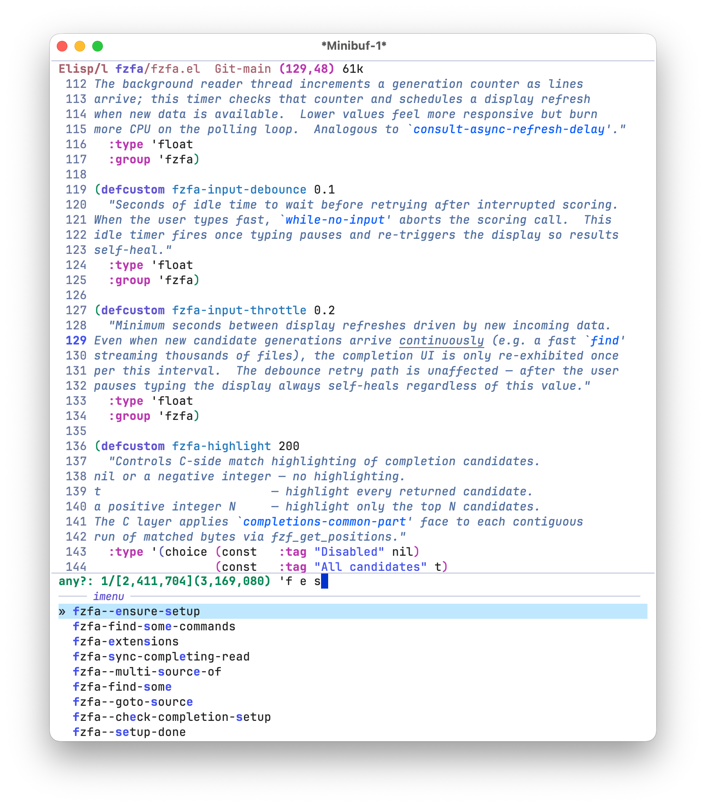

#+TITLE: fzfa
#+STARTUP: noindent

[[https://github.com/jojojames/fzfa/actions/workflows/test.yaml][https://github.com/jojojames/fzfa/actions/workflows/test.yaml/badge.svg]]

[[./screenshots/demo.gif]]

This package provides async fuzzy completion for Emacs backed by
[[https://github.com/dangduc/fzf-native][fzf-native]].
A shell command streams candidates into a background reader thread;
[[https://github.com/junegunn/fzf][fzf]] scores and sorts them in parallel
across all available CPU cores; results land in a standard ~completing-read~
UI incrementally as the shell command is still running.

It is designed for candidate sets too large for synchronous completion —
hundreds of thousands to millions of files or lines — where other solutions
are too slow or don't match candidates fuzzily.

* Why

Existing async completion packages share a fundamental design problem: the
user's query string is consumed in *two separate stages* by two different
matching algorithms.

Take ~consult-ripgrep~ as an example. The query is first passed directly to
~rg~ as a pattern, narrowing the candidate pool at the shell level.  The
survivors are then handed back to Emacs where the active ~completion-style~
rescores and re-sorts them.  Those two stages may use incompatible matching
semantics: ~rg~ applies regex or literal matching while the completion style
applies its own fuzzy or flex logic.

e.g. [[https://github.com/minad/consult#asynchronous-search][consult: asynchronous search]]

~fzfa~ eliminates the two-stage problem entirely. The shell command runs
*without a query* and emits candidates unconditionally. The user's query is
given *only* to fzf, which handles both filtering and scoring in a single,
coherent pass.

This is equivalent to calling ~fzf~ directly in the shell.

** The fzf algorithm

fzf uses a modified Smith-Waterman sequence alignment algorithm.  Every
character of the query must appear in the candidate in order, but not
necessarily consecutively — standard fuzzy matching.  Bonus points are
awarded for matching at word boundaries, path component separators, and
camelCase transitions, which causes semantically better matches to rank
higher than incidental character matches.

Scores are bounded non-negative integers (typically 0–10 000), which makes
radix-style counting sort feasible and avoids the O(n log n) overhead of
comparison sort for large candidate sets.

- [[https://github.com/junegunn/fzf][fzf]] — original fzf written in Go
- [[https://github.com/nvim-telescope/telescope-fzf-native.nvim][telescope-fzf-native.nvim]]
  — C port of fzf
- [[https://github.com/dangduc/fzf-native][fzf-native]] — Emacs wrapper

** Multi-component filtering

Queries may contain multiple space-separated terms.
This mirrors the fzf command-line search syntax:

| Syntax          | Meaning                                  |
|-----------------+------------------------------------------|
| ~foo bar~       | fuzzy-match both ~foo~ and ~bar~         |
| ~'foo~          | exact substring match for ~foo~          |
| ~^foo~          | prefix match for ~foo~                   |
| ~foo$~          | suffix match for ~foo~                   |
| ~!foo~          | exclude candidates matching ~foo~        |
| ~foo | bar~ | OR: match ~foo~ or ~bar~                 |

For example, typing ~el$ !test~ finds files ending in ~.el~ that do not
contain ~test~.

Refer to the full query syntax:
[[https://github.com/nvim-telescope/telescope-fzf-native.nvim#telescope-fzf-nativenvim][telescope-fzf-native query syntax]]

** Multithreaded scoring

Scoring is performed by
[[https://github.com/dangduc/fzf-native][fzf-native]],
a C dynamic module that spawns multiple worker threads to split up the work.

Both ~fussy~ and ~fzfa~ are multithreaded at the C layer.  With ~fussy~,
Emacs blocks until the full candidate list is scored and returned — suitable
for in-memory lists.  ~fzfa~ runs the shell command in a background
process and incrementally refreshes the completion UI as candidates arrive
and are scored.

* Installation

Dependencies:

~fzf-native~

Main Repo:

#+begin_src emacs-lisp :tangle yes
  (use-package fzf-native
    :vc (:url "https://github.com/dangduc/fzf-native" :rev :newest))
#+end_src

Minimal setup:

#+begin_src emacs-lisp :tangle yes
  (use-package fzfa
    :vc (:url "https://github.com/jojojames/fzfa" :rev :newest))
#+end_src

Recommended:

#+begin_src emacs-lisp :tangle yes
  (use-package fzf-native
    :vc (:url "https://github.com/dangduc/fzf-native" :rev :newest))

  (use-package fussy
    :vc (:url "https://github.com/jojojames/fussy" :rev :newest)
    :config
    (fussy-setup-fzf)
    (fussy-eglot-setup)
    (fussy-company-setup))

  (use-package fzfa
    :vc (:url "https://github.com/jojojames/fzfa" :rev :newest))
#+end_src

This sets up a consistent ~completing-read~ and ~completion-in-region~
experience using ~fzf~ as the core filtering/scoring algorithm.

* Quick Start

#+begin_src emacs-lisp :tangle yes
  ;; No explicit setup needed — just call any command:
  (fzfa-find-any)
  (fzfa-rg)
  (fzfa-fd)
  (fzfa-find)
  (fzfa-git-ls-files)
#+end_src

* Commands

All commands open the selected candidate in Emacs.

The list here is on best efforts, might be inaccurate.

** File finders

| ~fzfa~                       | ~counsel~           | ~consult~             |
|-----------------------------------+---------------------+-----------------------|
| ~fzfa-find~                  | ~counsel-find-file~ | ~consult-find~        |
| ~fzfa-fd~                    | —                   | ~consult-fd~          |
| ~fzfa-rg-files~              | —                   | ~consult-find~        |
| ~fzfa-ag-files~              | —                   | —                     |
| ~fzfa-git-ls-files~          | ~counsel-git~       | —                     |
| ~fzfa-hg-files~              | —                   | —                     |
| ~fzfa-recent-file~           | ~counsel-recentf~   | ~consult-recent-file~ |
| ~fzfa-locate~                | ~counsel-locate~    | ~consult-locate~      |
| ~fzfa-shell-command~         | —                   | —                     |
| ~fzfa-shell-project-command~ | —                   | —                     |

(macOS Spotlight commands — ~fzfa-spotlight~, ~-spotlight-apps~,
~-spotlight-audio~ — ship in the ~spotlight~ extension, on by default.
See *Extensions* below.)

** Emacs based

| ~fzfa~                       | ~counsel~              | ~consult~                              |
|-------------------------------+------------------------+----------------------------------------|
| ~fzfa-buffer~                | ~ivy-switch-buffer~    | ~consult-buffer~                       |
| ~fzfa-bookmark~              | ~counsel-bookmark~     | ~consult-bookmark~                     |
| ~fzfa-M-x~                   | ~counsel-M-x~          | —                                      |
| ~fzfa-M-x-for-buffer~        | —                      | ~consult-mode-command~                 |
| ~fzfa-yank-pop~              | ~counsel-yank-pop~     | ~consult-yank-pop~                     |
| ~fzfa-theme~                 | ~counsel-load-theme~   | ~consult-theme~                        |
| ~fzfa-tramp~                 | —                      | —                                      |
| ~fzfa-imenu~                 | ~counsel-imenu~        | ~consult-imenu~                        |
| ~fzfa-imenu-all~             | —                      | ~consult-imenu-multi~                  |
| ~fzfa-imenu-all-but-current~ | —                      | —                                      |
| ~fzfa-flymake~               | —                      | ~consult-flymake~                      |
| ~fzfa-flymake-project~       | —                      | ~consult-flymake~ (with prefix arg)    |

** Content search

Grep-style commands parse ~FILE:LINE:CONTENT~ output and jump directly to
the matching line.

| ~fzfa~                   | ~counsel~ / ~ivy~  | ~consult~            |
|-------------------------------+--------------------+----------------------|
| ~fzfa-rg~                | ~counsel-rg~       | ~consult-ripgrep~    |
| ~fzfa-ag~                | ~counsel-ag~       | —                    |
| ~fzfa-git-grep~          | ~counsel-git-grep~ | ~consult-git-grep~   |
| ~fzfa-grep~              | ~counsel-grep~     | ~consult-grep~       |
| ~fzfa-grep-current-file~ | ~counsel-grep~     | ~consult-line~       |
| ~fzfa-ugrep~             | —                  | —                    |
| ~fzfa-swiper~            | ~swiper~           | ~consult-line~       |
| ~fzfa-swiper-all~        | ~swiper-all~       | ~consult-line-multi~ |
| ~fzfa-hungry-swiper~     | —                  | —                    |
| ~fzfa-hungry-find~       | —                  | —                    |

** Hungry variants

The hungry commands derive their search scope from the currently open buffers.
They collect ~buffer-file-name~ for every file-visiting buffer, extract the
parent directory of each, then deduplicate: if directory ~A~ is a prefix of ~B~,
~B~ is dropped since ~A~'s recursive search already covers it.  The resulting
directory list is passed as arguments to a single shell command.

| Command                   | Tool       | What it searches                       |
|---------------------------+------------+----------------------------------------|
| ~fzfa-hungry-find~   | fd / find  | Files under all derived directories    |
| ~fzfa-hungry-swiper~ | rg / grep  | Line content under all derived dirs    |

** Multi-source

| ~fzfa~                 | ~consult~        |
|-----------------------------+------------------|
| ~fzfa-find-any~   | ~consult-buffer~ |
| ~fzfa-find-some~  | ~consult-buffer~ |
| ~fzfa-passwords~  | (no direct analog) |
| ~fzfa-evil-any~   | (no direct analog) |

~fzfa-find-any~ merges several sources into a single
~completing-read~ (groups for buffers, recent files, hungry-find, …),
ranks each group by its top fzf score, and dispatches the chosen
candidate back to the originating command's action.

The command list lives in ~fzfa-find-any-commands~ — by default
~(fzfa-imenu fzfa-buffer fzfa-recent-file fzfa-hungry-find
fzfa-imenu-all-but-current fzfa-M-x fzfa-hungry-swiper fzfa-locate)~.
Add any other arg-less ~fzfa~ command to that list and it shows up as
its own group, with no source plist or factory function to maintain:
the source is *derived from the command's existing definition* via the
=:extract= / =:inject= dispatch in ~fzfa-async-completing-read~ and
~fzfa-sync-completing-read~ (see ~architecture.org~ for the full flow).

#+begin_src emacs-lisp :tangle yes
  (setq fzfa-find-any-commands
        '(fzfa-buffer
          fzfa-recent-file
          fzfa-hungry-find
          fzfa-spotlight-apps))
#+end_src

For ad-hoc combinations, call ~fzfa-multi-read~ directly:

#+begin_src emacs-lisp :tangle yes
  (defun my/fzfa-files-only ()
    (interactive)
    (fzfa-multi-read
     '(fzfa-recent-file fzfa-hungry-find fzfa-locate)
     :prompt "files: "))
#+end_src

~fzfa-passwords~ is a built-in multi over ~fzfa-pass-copy~
and ~fzfa-chrome-pass-copy~ — one prompt covers both
~password-store~ and Chrome's password manager, with the chosen
entry's password copied to the kill ring via the originating source.
Requires the ~chrome~ extension (and on macOS, the deps listed for
Chrome passwords above).

* Extensions

Optional integrations ship as sibling files (~fzfa-pass.el~,
~fzfa-notmuch.el~, etc.) and are opt-in via ~fzfa-extensions~
— a list of short symbols that the lazy setup walks: for each ~SYMBOL~
it ~require~ s ~fzfa-SYMBOL~ and calls ~fzfa-SYMBOL-setup~ if
defined.  Extension loading happens the first time you invoke any
fzfa command (or up front if you call ~fzfa-setup~
explicitly).

| Symbol      | Library                | Soft dependency   | Commands                                                                                                                              |
|-------------+------------------------+-------------------+---------------------------------------------------------------------------------------------------------------------------------------|
| ~pass~      | ~fzfa-pass~       | ~password-store~  | ~fzfa-pass~ (copy), ~fzfa-pass-edit~, ~-rename~, ~-delete~, ~-add~, ~-generate~, ~-url~ — modeled on ~ivy-pass~ |
| ~spotlight~ | ~fzfa-spotlight~  | macOS ~mdfind~    | ~fzfa-spotlight~, ~fzfa-spotlight-apps~, ~fzfa-spotlight-audio~                                                        |
| ~music~     | ~fzfa-music~      | macOS ~Music.app~ | ~fzfa-music~, ~-by-artist~, ~-by-genre~, ~-playlist~, ~-playlist-shuffle~, ~-refresh~ — modeled on ~helm-itunes~                |
| ~chrome~    | ~fzfa-chrome~     | none (bookmarks); macOS ~sqlite3~ + ~security~ + ~openssl~ + ~python3~ (passwords) | bookmarks: ~fzfa-chrome-bookmarks~ (default), ~-edit~, ~-copy-url~, ~-refresh~ — open Chromium-family bookmarks via ~browse-url~.  passwords (macOS only): ~fzfa-chrome-pass-copy~ (default), ~-copy-username~, ~-url~, ~-refresh~ — decrypts entries from Chrome's Login Data SQLite DB using the keychain entry ~Chrome Safe Storage~ |
| ~company~   | ~fzfa-company~    | ~company~         | ~fzfa-company~ — fuzzy-filter current ~company-mode~ candidates and finish; modeled on ~helm-company~ / ~counsel-company~ / ~consult-company~ |
| ~mail~      | ~fzfa-mail~       | macOS ~Mail.app~  | ~fzfa-mail~, ~fzfa-mail-refresh~ — browse and open inbox messages                                                          |
| ~notmuch~   | ~fzfa-notmuch~    | ~notmuch~ (CLI + Emacs package) | ~fzfa-notmuch~, ~fzfa-notmuch-tree~ — run a notmuch query and fuzzy-pick a thread to open; modeled on ~helm-notmuch~ / ~counsel-notmuch~ / ~consult-notmuch~ |
| ~flymake~   | ~fzfa-flymake~    | none (built-in)   | ~fzfa-flymake~ (current buffer), ~fzfa-flymake-project~ (all buffers in the current project) — modeled on ~consult-flymake~ |
| ~evil~      | ~fzfa-evil~       | ~evil~            | ~fzfa-evil-marks~ (jump to a buffer-local or global mark, candidate includes ~BUFFER:LINE: <content>~ so fzf scores against the line preview), ~fzfa-evil-registers~ (paste text registers / execute macro-vector registers), ~fzfa-evil-jumps~ (window jump list — ~C-o~/~C-i~ history — with line preview when the buffer is loaded), ~fzfa-evil-ex-history~ (re-run an entry from ~evil-ex-history~ via ~evil-ex-execute~), ~fzfa-evil-search-history~ (re-run a pattern from ~evil-ex-search-history~ and update ~evil-ex-search-pattern~ so ~n~/~N~ continue working), ~fzfa-evil-command-window~ (unified ex + search history picker grouped by source), ~fzfa-evil-any~ (multi-source picker over the other commands, configurable via ~fzfa-evil-any-commands~) |

Default value of ~fzfa-extensions~ is ~(ag chrome company emacs evil fd find flymake git grep hg hungry locate mail music notmuch pass rg shell spotlight ugrep)~.
Each loads without its soft dependency present — the dependency is
only required when you invoke one of the extension's commands.  Soft
dependencies are not declared in ~Package-Requires~ — install them
yourself if you use the extension:

#+begin_src emacs-lisp :tangle yes
  (use-package password-store)
#+end_src

To disable extension loading entirely:

#+begin_src emacs-lisp :tangle yes
  (use-package fzfa
    :vc (:url "https://github.com/jojojames/fzfa" :rev :newest)
    :custom (fzfa-extensions nil))
#+end_src

* Completion style compatibility

~fzfa~ registers and uses its own ~completion-style~ named ~fzfa~.
This style is only a passthrough: it accepts the query string as-is and forwards
it directly to the ~fzf~ scoring layer without applying any transformation.

*This style must not be added to the global ~completion-styles~ list.*
Doing so applies it to every ~completing-read~ in the session, including
callers that pass a plain list or hash-table as the collection, which will
trigger an error.  fzfa wires the style correctly via
~completion-category-overrides~ for the ~fzfa~ category only.  Other
~completion-styles~ packages (e.g. ~orderless~, ~hotfuzz~) may override
this.

Do not set ~fzfa~ as a fallback in ~completion-styles~.  Do not combine
it with ~orderless~, ~fussy~, ~flex~, or any other style for the ~fzfa~
category — the results are already scored and sorted by fzf; re-filtering
by another style corrupts the ranking.

* Companion package — fussy

The recommended companion package is
[[https://github.com/jojojames/fussy][fussy]],
for general ~completing-read~ and ~completion-at-point~ (e.g. code
completion).  Both ~fussy~ and ~fzfa~ are backed by the same
[[https://github.com/dangduc/fzf-native][fzf-native]]
module, giving you consistent fuzzy matching semantics with ~fzf~ across
both synchronous and asynchronous contexts.

~fussy~ operates synchronously on in-memory candidate lists and integrates
with ~company~, ~corfu~, ~eglot~, and all standard ~completing-read~
frontends.  ~fzfa~ handles the case where candidates come from a shell
command (e.g. ~find~ or ~ripgrep~) and must be streamed incrementally.

#+begin_src emacs-lisp :tangle yes
  (use-package fzf-native
    :vc (:url "https://github.com/dangduc/fzf-native" :rev :newest))

  ;; Synchronous fuzzy completion for code, buffers, M-x, etc.
  (use-package fussy
    :vc (:url "https://github.com/jojojames/fussy" :rev :newest)
    :config
    (fussy-setup-fzf)
    (fussy-eglot-setup)
    (fussy-company-setup))

  ;; Async fuzzy completion for large file/grep searches.
  (use-package fzfa
    :vc (:url "https://github.com/jojojames/fzfa" :rev :newest))
#+end_src

* Integrations

~fzfa~ works through the standard Emacs ~completing-read~ API and is
compatible with any frontend that calls the completion table function on
each input change.

| Frontend      | Status    | Notes                                                          |
|---------------+-----------+----------------------------------------------------------------|
| ~vertico~     | Supported | Recommended.  Generation-based refresh via ~vertico--exhibit~. |
| ~icomplete~   | Supported | Refreshes via ~icomplete-exhibit~.                             |
| ~fido~        | Supported | Built on ~icomplete~; works without extra configuration.       |
| ~ivy/counsel~ | Supported | Push model via ~ivy--set-candidates~. See below.               |
| ~helm~        | Supported | Dedicated source path; auto-dispatched when ~helm-mode~ is active. See below. |

Caveat: I mostly use ~vertico~ these days so wasn't exhaustive with using the
other completion systems.
** ivy / counsel
Ivy uses a *push model*: the completion UI holds its own internal candidate
list (~ivy--all-candidates~) and does not re-call the collection function
on each display refresh.  This conflicts with ~fzfa~'s pull model,
where vertico re-calls our collection lambda to get fresh scored results.

~fzfa~ handles this with a dedicated push path.  The polling timer
calls ~fzf-native-async-candidates~ directly, pushes the results via
~ivy--set-candidates~, and redraws via ~ivy--exhibit~ — the same approach
used by counsel's async commands.  The stats prompt (directory, selection
index, filtered/total counts) is delivered via ~ivy-pre-prompt-function~,
which ivy prepends to the prompt string on each redraw.
** helm
When ~helm-mode~ is active, ~fzfa-async-completing-read~ automatically
dispatches to a dedicated ~fzfa--helm-completing-read~ path — no
extra configuration is needed.

Helm uses a ~helm-source-sync~ source with ~:match-dynamic t~, which tells
helm to call the ~:candidates~ function on every input change rather than
holding its own filtered list.  ~:nohighlight t~ is set so helm does not
apply its own highlighting on top of the C-side ~completions-common-part~
faces already embedded in the candidate strings.

A polling timer checks ~fzf-native-async-generation~ at
~fzfa-refresh-delay~ intervals and calls ~helm-force-update~ whenever
the background scoring thread has produced new results, keeping the helm
buffer live as candidates stream in.
** transient
A [[https://github.com/jojojames/matcha/blob/master/matcha-fzfa.el][matcha transient]] is
 defined for invoking all ~fzfa~ commands from a
single keybinding via [[https://github.com/jojojames/matcha][matcha]].
* Customization

| Variable                       | Default   | Description                                            |
|--------------------------------+-----------+--------------------------------------------------------|
| ~fzfa-max-candidates~     | 10000     | Max candidates returned to Elisp (see note below).    |
| ~fzfa-refresh-delay~      | 0.05      | Seconds between generation polls.                     |
| ~fzfa-input-debounce~     | 0.1       | Idle seconds to retry after an interrupted scoring.   |
| ~fzfa-input-throttle~     | 0.2       | Min seconds between UI refreshes driven by new data.  |
| ~fzfa-directory~          | ~nil~     | Per-call directory override; supersedes project backend (see note below). |
| ~fzfa-project-backend~    | ~project~ | How to resolve the root directory (see note below).   |
| ~fzfa-highlight~          | 200       | C-side match highlighting; nil/t/N (see note below).  |
| ~fzfa-max-line-length~    | 256       | Per-line character limit; nil/+N/-N (see note below). |
| ~fzfa-cache-size~         | 40        | Per-session LRU cache entries (see note below).       |
| ~fzfa-case-mode~          | ~smart~   | Case sensitivity: ~smart~ / ~ignore~ / ~respect~.     |
| ~fzfa-extensions~         | (see *Extensions* below) | Extensions to ~require~ during setup. |

~fzfa-highlight~ controls C-side match highlighting.  After the scoring
pass, the C module calls ~fzf_get_positions~ for the top N candidates and
applies the ~completions-common-part~ face to each contiguous run of matched
characters via ~put-text-property~.  This happens entirely inside the C module
before strings are handed to Emacs, so there is no Elisp regex overhead.

The defcustom accepts three forms:

| Value | Behavior                                      |
|-------+-----------------------------------------------|
| ~nil~ | No highlighting.                              |
| ~t~   | Highlight every returned candidate.           |
| N     | Highlight the top N candidates (default 200). |

Setting a cap rather than always highlighting all candidates is intentional:
~fzf_get_positions~ is cheap but not free, and users cannot see more than
~20–50 candidates without scrolling.  200 provides comfortable headroom.

#+begin_src emacs-lisp :tangle yes
  (setq fzfa-highlight nil)   ; disable entirely
  (setq fzfa-highlight t)     ; highlight all returned candidates
  (setq fzfa-highlight 500)   ; highlight top 500
#+end_src

~fzfa-max-line-length~ filters lines from the subprocess before they
enter the candidate pool.  Minified JavaScript, base64 payloads, and other
pathologically long lines slow scoring and produce unreadable candidates.
Lowering this number can be a huge performance improvement.

| Value  | Behavior                                               |
|--------+--------------------------------------------------------|
| ~nil~  | No limit — every line is accepted unchanged.           |
| ~+N~   | Exclude lines longer than N characters (default 256).  |
| ~-N~   | Include but truncate to N characters.                  |

The check fires in the reader thread immediately after ANSI stripping, before
any allocation, so oversized lines never reach the scoring path.

#+begin_src emacs-lisp :tangle yes
  (setq fzfa-max-line-length nil)   ; no limit
  (setq fzfa-max-line-length 300)   ; exclude lines > 300 chars
  (setq fzfa-max-line-length -300)  ; truncate to 300 chars, keep all
#+end_src

~fzfa-max-candidates~ caps only the number of strings consed into the
Emacs list returned to the completion UI.  The C layer always scores and
sorts *all* candidates: every matching string is passed through the fzf
scoring threads, the full scored set is counting-sorted, and then only the
top N are handed back to Elisp.  The ~[FILTERED]~ count in the prompt
always reflects the true number of matches, not the capped return value.
Lowering this number can be a huge performance improvement.

~fzfa-cache-size~ controls a per-session LRU result cache inside the
C module.  Each entry stores the top-K results and the full matched-
candidate index for one query.  Three lookup outcomes:

| Outcome     | When                                                | Effect                                          |
|-------------+-----------------------------------------------------+-------------------------------------------------|
| Exact-fresh | Same query, pool unchanged                          | Return cached results; no scoring scheduled.    |
| Exact-stale | Same query, more candidates streamed in since       | Return cached top-K immediately, refine in BG.  |
| Prefix      | New query is a refinement of a cached one           | Return prefix's top-K, refine on prior matches. |

Refinement scoring scans only the prior match set + delta candidates
instead of the full pool — for typing past the first 2-3 chars this
typically drops scan size by 100-1000×.  Subsumption uses both
byte-prefix matching (~fo~ → ~foo~, ~fo~ → ~fo bar~) and term-set
comparison (~fo~ → ~x fo~, ~fo bar~ → ~bar foo~).  OR queries
(containing ~|~) are excluded — adding an OR alternate widens the
match set unpredictably.

A larger cache keeps a longer typing trail in LRU.  Helps backspace:
backing up several keystrokes still hits cached entries as long as
those intermediate queries weren't evicted by unrelated lookups.

Read once at session start; changing it does not affect running sessions.

This is done because anything interfacing with Emacs itself is easily the
slowest part of the algorithm. Even converting C strings to Emacs strings
can be a burden when the total collection size is millions of candidates.
In practice, the cap should not be an issue (and is configurable anyways)
since it's returning the top N candidates at any one time.

~fzfa-case-mode~ controls how the fzf scorer treats letter case.
Read on every scoring call; changes take effect immediately.

| Value      | Behavior                                                          |
|------------+-------------------------------------------------------------------|
| ~smart~    | Case-insensitive when the query is all lowercase; case-sensitive once it contains any uppercase character (fzf's default). |
| ~ignore~   | Always case-insensitive.                                         |
| ~respect~  | Always case-sensitive.                                           |

#+begin_src emacs-lisp :tangle yes
  (setq fzfa-case-mode 'smart)    ; default
  (setq fzfa-case-mode 'ignore)
  (setq fzfa-case-mode 'respect)
#+end_src

~fzfa-directory~ is a ~let~-bindable override that takes priority over
project detection.  Use it when extending a built-in command that you want
to run in the current directory rather than the project root:

#+begin_src emacs-lisp :tangle yes
  (defun my-rg-here ()
    (interactive)
    (let ((fzfa-directory default-directory))
      (fzfa-rg)))
#+end_src

The full priority chain is:
~fzfa-directory~ > ~fzfa-project-backend~ > ~default-directory~

~fzfa-project-backend~ controls which directory file-search and grep
commands run in.  The default ~project~ matches the behavior of ~consult~.
Available values:

| Value        | Behavior                                                              |
|--------------+-----------------------------------------------------------------------|
| ~project~    | Uses ~project.el~ (~project-current~ / ~project-root~).  Default.    |
| ~projectile~ | Uses ~projectile-project-root~ when ~projectile-mode~ is active.     |
| ~nil~        | Uses ~default-directory~ unchanged (no project detection).           |
| /function/   | Calls the function with no arguments; it should return a directory.  |

Example with a custom function:

#+begin_src emacs-lisp :tangle yes
  (setq fzfa-project-backend
        (lambda () (locate-dominating-file default-directory ".git")))
#+end_src

The prompt overlay shows live status during a search:

: DIR IDX/[FILTERED](TOTAL)

- ~DIR~ — abbreviated working directory
- ~IDX~ — current selection index (vertico, ivy)
- ~FILTERED~ — candidates passing the current fzf query
- ~TOTAL~ — total candidates collected from the shell command so far

* Custom commands

~fzfa~ is designed to be extensible.  New commands are thin wrappers
around ~fzfa-async-completing-read~, which accepts keyword arguments:

| Argument                 | Default                            | Description                                                                 |
|--------------------------+------------------------------------+-----------------------------------------------------------------------------|
| ~:prompt~                | first token of ~:command~ + ~": "~ | Minibuffer prompt string.                                                   |
| ~:command~               | —                                  | Shell command whose stdout becomes candidates.                              |
| ~:directory~             | ~default-directory~                | Working directory for the command.                                          |
| ~:group~                 | ~nil~                              | ~group-function~ for candidate grouping.                                    |
| ~:skip-executable-check~ | ~nil~                              | Skip the built-in ~executable-find~ guard on the first token of ~:command~. |

The command string is passed verbatim to ~shell-file-name~ (~-c~), so pipes,
redirections, and shell quoting all work as expected.

~fzfa-async-completing-read~ automatically checks that the first token of
~:command~ is present in ~exec-path~ (via ~executable-find~) before starting
the session.  Pass ~:skip-executable-check t~ when the command uses a shell
builtin, alias, or has already been validated by the caller.
~fzfa-shell-command~ skips the check because the user's shell resolves
aliases and builtins that ~executable-find~ cannot see.

For one-off queries, ~fzfa-shell-command~ prompts for a command
interactively and runs it in ~default-directory~;
~fzfa-shell-project-command~ does the same from the project root.

#+begin_src emacs-lisp :tangle yes
;;;###autoload
(defun fzfa-spotlight-pdfs ()
  "Find a PDF file system-wide using Spotlight.
Opens the selected PDF with `open'."
  (interactive)
  (when-let* ((result (fzfa-async-completing-read
                       :prompt "spotlight pdfs: "
                       :command "mdfind 'kMDItemFSName == \"*.pdf\"'"
                       :directory default-directory)))
    (start-process "default-app" nil "open" result)))
#+end_src

* Comparison

- ~fussy~ serves a similar role to ~orderless~: scoring and filtering for
  general ~completing-read~ (M-x, buffers, code completion, etc.).
- ~fzfa~ serves a similar role to ~consult~/~counsel~, e.g.
  ~counsel-rg~ / ~counsel-git~ / ~consult-ripgrep~ / ~consult-find~
  for file and content search.
- [[https://github.com/bling/fzf.el][fzf.el]] is another alternative that
  serves as a frontend to the ~fzf~ binary.  It is a good option, though
  it may feel alien to Emacs since all filtering has to be built up and
  sent to the external process.
- ~counsel-fzf~ is another option.  See the original implementation:
  [[https://github.com/abo-abo/swiper/pull/1151][swiper: add counsel-fzf]]
  The downside is that each new input resets the search, which is
  extremely slow over millions of files.  This problem is shared with
  ~consult~-related commands: each keystroke triggers a new filter query
  to the underlying binary.
- [[https://github.com/minad/affe][affe]] is the closest architectural cousin.
  Like ~fzfa~, it runs a producer process in the background and filters
  candidates asynchronously.  The key differences:
  ([[https://github.com/minad/affe#details][affe: details]]):
  - *Matching*: affe transforms the query into a list of regular expressions
    and filters with ~all-completions~, which may plug into ~orderless~ for
    the final filtering and sorting.
  - *Ranking*: Both ~affe~ and ~orderless~ do not do any scoring or matching.
  - *Performance*: affe calls out to an external process for the initial
    filtering but a lot of postprocessing runs in Elisp. (e.g. calculating
    highlights or general list processing)
  A quick eye test against the home directory using ~affe-grep~ vs ~fzfa-rg~
  shows about 1-2 million candidates processed after a few seconds compared to
  ~fzfa~ which hits 10-20 million in the same time span.

(This comparison is on best efforts, so might be inaccurate. :))

In comparison to similar pre-existing packages like ~consult~ / ~counsel~ / ~helm~,
~fzfa~ provides:

*Speed.* fzf scoring runs multithreaded in C with a counting-sort final
pass that is O(n + max_score).  Results stream incrementally so the UI
stays responsive with *tens of millions* of candidates.  The goal is to match
or exceed the performance of ~fzf~ in the terminal from within Emacs.

*True fuzzy matching.* A single query string is used for both filtering
and scoring in one pass — no two-stage conflict, no mismatches between
what the shell tool matched and what the completion framework ranked.

*Simplicity.* ~fzfa.el~ is roughly 2000 lines of Emacs Lisp, most of
which declares the built-in commands and ~fzf-native-module.c~ is also
roughly 2000 lines.

** Downsides
~fzfa~ requires
[[https://github.com/dangduc/fzf-native][fzf-native]],
a compiled C dynamic module that requires a C compiler and CMake to build.

If a pure-Elisp solution is preferred:

[[https://github.com/abo-abo/swiper][counsel]]
[[https://github.com/emacs-helm/helm][helm]]
[[https://github.com/minad/consult][consult]]

are mature, widely supported alternatives that require no native compilation.

** Prior Discussions
[[https://github.com/abo-abo/swiper/pull/1151][swiper: add counsel-fzf]]
[[https://github.com/abo-abo/swiper/issues/848][swiper: fzf integration]]
[[https://github.com/minad/consult/issues/587][consult: fzf integration]]
[[https://github.com/minad/consult/discussions/1312][consult: async fzf]]

* Architecture

For the Elisp pipeline this package owns — async and sync
~completing-read~ entry points, custom completion style, frontend
abstraction, timer model, prompt overlay — see
[[file:architecture.org][architecture.org]].

The C scoring module under ~fzfa~ is documented separately in
[[https://github.com/dangduc/fzf-native/blob/HEAD/architecture.org][fzf-native's architecture overview]]
(thread/lock model, ~AsyncSession~, arena allocator, counting sort,
~score_abort~ rule).

For ~fussy~, the broader fuzzy completion-style framework that
~fzfa~ deliberately bypasses, see
[[https://github.com/jojojames/fussy/blob/HEAD/architecture.org][fussy's architecture overview]].
* Acknowledgements
[[https://github.com/abo-abo/swiper][counsel]]
[[https://github.com/emacs-helm/helm][helm]]
[[https://github.com/minad/consult][consult]]
